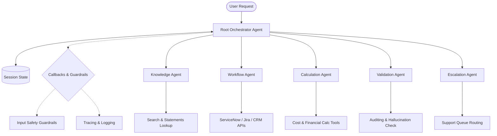

# Enterprise ADK Multi-Agent Orchestrator

This repository contains a production-grade multi-agent system built using the **Google Agent Development Kit (ADK)** and powered by Gemini. It demonstrates a complex hierarchical orchestration pattern featuring structured routing, custom tools, state management, safety guardrails, automated unit/integration testing, and evaluations.

---

## 🏗 System Architecture

The core of the system is a **Root Orchestrator** which delegates specialized tasks to a fleet of 5 sub-agents depending on the user's intent. 



### Sub-Agents & Responsibilities
1. **Root Orchestrator (`root_agent`)**: Entry point for all user prompts. It reads/writes session state and routes requests to the appropriate sub-agents.
2. **Knowledge Agent (`knowledge_agent`)**: Handles lookups for corporate policies, travel guidelines, and transaction records from financial statements.
3. **Workflow Agent (`workflow_agent`)**: Executes business workflows, such as creating Jira issues or ServiceNow incidents.
4. **Calculation Agent (`calculation_agent`)**: Compiles cost estimates, performs growth forecasting, and aggregates statement metrics.
5. **Validation Agent (`validation_agent`)**: Audits final proposed responses, checking for compliance, groundings, and hallucination scores.
6. **Escalation Agent (`escalation_agent`)**: Manages human agent handoffs and support queues if the validator fails or flags a response.

---

## 📂 Project Structure

```
├── agent.py                   # Top-level ADK App entry point
├── app.py                     # FastAPI server exposing the agent API
├── agents-cli-manifest.yaml   # ADK CLI manifest configuration
├── requirements.txt           # Python package dependencies
├── pyproject.toml             # Dev dependencies and pytest configurations
├── agents/                    # Multi-agent definitions and prompt files
│   ├── root/                  # Root Orchestrator
│   ├── knowledge_agent/       # Financial transactions / policy lookup
│   ├── workflow_agent/        # Jira / ServiceNow action workflows
│   ├── calculation_agent/     # Formulas and aggregations
│   ├── validation_agent/      # Hallucination scoring and quality checks
│   └── escalation_agent/      # Support queues and handoffs
├── tools/                     # Python functions exposed to agents as tools
│   ├── session_tools.py       # Session state management
│   ├── search_tools.py        # CSV statement search engines
│   ├── api_tools.py           # Simulated Jira & ServiceNow integrations
│   └── calculation_tools.py   # Math operations and forecasting
├── callbacks/                 # Tracing, logging, and safety/PII guardrails
├── config/                    # System setting, model, and retry configs
├── data/                      # Local data files (e.g. CSV statements)
├── eval/                      # Evaluation datasets and runner configurations
├── deployment/                # IaC (Terraform), Cloud Build, and deployment scripts
└── tests/                     # Test suite
    ├── unit/                  # Tests for tools and logic
    └── integration/           # Tests for agent initialization and pipeline integrity
```

---

## 🚀 Getting Started

### 📋 Prerequisites
- Python 3.11+
- A Google Cloud Project with the Vertex AI API enabled (if utilizing Vertex AI models)
- Active Google Cloud credentials configured (`gcloud auth application-default login`)

### 🔧 Installation
1. **Clone the repository**:
   ```bash
   git clone https://github.com/karitselmuthu/ADK_Production.git
   cd ADK_Production
   ```

2. **Set up a Virtual Environment**:
   ```bash
   python -m venv .venv
   source .venv/bin/activate
   ```

3. **Install Dependencies**:
   ```bash
   pip install -r requirements.txt
   ```

4. **Environment Variables**:
   Copy `.env.example` to `.env` and fill in your settings:
   ```bash
   cp .env.example .env
   ```

   Key options in `.env`:
   - `GOOGLE_CLOUD_PROJECT`: Your GCP project ID.
   - `GOOGLE_CLOUD_LOCATION`: The location/region (e.g., `us-east1`).
   - `GOOGLE_GENAI_USE_VERTEXAI`: Set to `True` to route API calls through Vertex AI.

---

## 🖥 Running the Application

You can start the FastAPI server to expose endpoints for interacting with the agent:

```bash
python app.py
```

The server will start at **`http://localhost:8000`**.
- Interactive API documentation will be available at [http://localhost:8000/docs](http://localhost:8000/docs).
- You can send chat queries to the `/chat` endpoint.

---

## 🧪 Testing

The repository uses `pytest` for unit and integration testing.

Run all tests:
```bash
pytest
```

---

## 📊 Agent Evaluation

This project includes configuration and runner scripts to perform automated evaluation of agent answers against a golden dataset using the ADK CLI (`agents-cli eval`).

Run the evaluation pipeline:
```bash
python -m eval.evaluation_runner
```

This runs:
1. **Inference**: Exercises the agent over `eval/golden_dataset.json` and records traces.
2. **Grading**: Uses LLM-as-a-judge as defined in `eval/test_cases.yaml` to audit correct answers.
3. Reports are generated in `artifacts/grade_results/`.

---

## 🌐 Deployment

Deployment assets are provided in the `deployment/` folder:
- **Terraform (`deployment/terraform/`)**: Configures infrastructure on GCP.
- **Cloud Build (`deployment/cloudbuild.yaml`)**: Implements CI/CD for building and containerizing the FastAPI service.
- **Deploy Script (`deployment/deploy.sh`)**: Automates GCP Cloud Run setup and deployments.